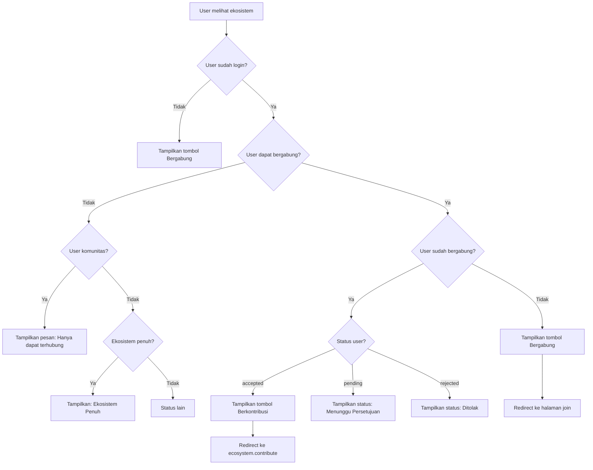
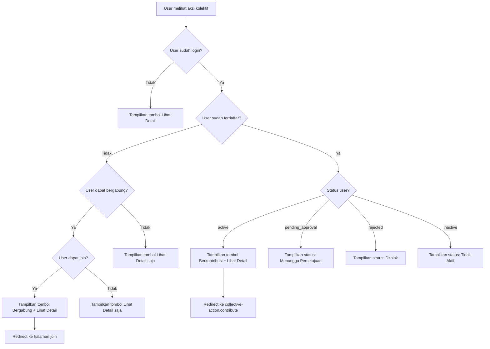

# Flow Diagram - Tombol Berkontribusi

## Flow untuk Ekosistem

## Flow untuk Aksi Kolektif

## Kondisi Status User

### Ekosistem
- **accepted**: User sudah diterima → Tombol "Berkontribusi"
- **pending**: User menunggu persetujuan → Status badge
- **rejected**: User ditolak → Status badge

### Aksi Kolektif
- **active**: User sudah aktif → Tombol "Berkontribusi" + "Lihat Detail"
- **pending_approval**: User menunggu persetujuan → Status badge
- **rejected**: User ditolak → Status badge
- **inactive**: User tidak aktif → Status badge

## Routes yang Digunakan

- `ecosystem.contribute` - Halaman kontribusi ekosistem
- `collective-action.contribute` - Halaman kontribusi aksi kolektif
- `ecosystem.join` - Halaman bergabung ekosistem
- `collective-action.join` - Halaman bergabung aksi kolektif
