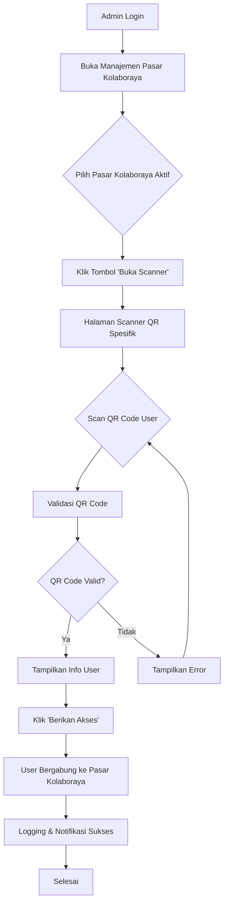
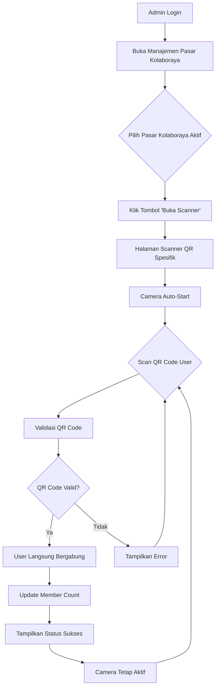

# Pasar Kolaboraya QR Scanner Implementation

## Overview
Implementasi fitur scan QR untuk bergabung ke Pasar Kolaboraya dengan workflow yang disederhanakan sesuai permintaan user.

## Fitur yang Diimplementasikan

### 1. Tombol "Buka Scanner" di Halaman Manajemen Admin
- **File**: `resources/views/livewire/admin/pasar-kolaboraya-management.blade.php`
- **Fitur**: Tombol "Buka Scanner" muncul hanya untuk Pasar Kolaboraya yang statusnya "active"
- **Aksi**: Mengarahkan ke halaman scanner QR spesifik untuk Pasar Kolaboraya tersebut

### 2. Komponen Livewire Scanner QR Spesifik
- **File**: `app/Livewire/Admin/PasarKolaborayaQrScanner.php`
- **Fitur**: 
  - Scanner QR yang dikhususkan untuk Pasar Kolaboraya tertentu
  - Validasi QR code user
  - Langsung bergabung ke Pasar Kolaboraya yang dipilih
  - Riwayat scan per Pasar Kolaboraya
  - Logging akses yang diberikan

### 3. View Scanner QR yang Disederhanakan
- **File**: `resources/views/livewire/admin/pasar-kolaboraya-qr-scanner.blade.php`
- **Fitur**:
  - Tampilan scanner yang clean tanpa pilihan Pasar Kolaboraya
  - Informasi Pasar Kolaboraya yang sedang di-scan
  - Camera scanner dengan HTML5 QR Code library
  - Input manual QR code
  - Validasi dan konfirmasi akses
  - Riwayat scan

### 4. Route Scanner QR Spesifik
- **File**: `routes/web.php`
- **Route**: `admin/pasar-kolaboraya/{pasarKolaboraya}/qr-scanner`
- **Middleware**: Admin access required

## Workflow Baru

### Sebelum (Lama):
1. Admin buka QR Scanner umum
2. Pilih Pasar Kolaboraya dari dropdown
3. Scan QR code user
4. Berikan akses

### Sesudah (Baru):
1. Admin buka halaman Manajemen Pasar Kolaboraya
2. Klik tombol "Buka Scanner" pada Pasar Kolaboraya yang diinginkan
3. Langsung scan QR code user (tidak perlu pilih Pasar Kolaboraya lagi)
4. User otomatis bergabung ke Pasar Kolaboraya yang dipilih

## Keunggulan Implementasi

1. **Workflow Lebih Sederhana**: Admin tidak perlu memilih Pasar Kolaboraya setelah scan
2. **UI Lebih Clean**: Scanner hanya menampilkan fungsi scan tanpa elemen lain
3. **Konteks Jelas**: Admin tahu Pasar Kolaboraya mana yang sedang di-scan
4. **Riwayat Terpisah**: Setiap Pasar Kolaboraya memiliki riwayat scan sendiri
5. **Keamanan**: Hanya admin yang bisa akses scanner

## File yang Dimodifikasi/Dibuat

### File Baru:
- `app/Livewire/Admin/PasarKolaborayaQrScanner.php`
- `resources/views/livewire/admin/pasar-kolaboraya-qr-scanner.blade.php`

### File yang Dimodifikasi:
- `resources/views/livewire/admin/pasar-kolaboraya-management.blade.php` (tambahan tombol)
- `routes/web.php` (tambahan route)

## Cara Penggunaan

1. Login sebagai admin
2. Buka halaman "Manajemen Pasar Kolaboraya"
3. Pilih Pasar Kolaboraya yang statusnya "Aktif"
4. Klik tombol "Buka Scanner"
5. Scan QR code user atau input manual
6. Klik "Berikan Akses ke Pasar Kolaboraya"
7. User otomatis bergabung ke Pasar Kolaboraya tersebut

## Dependencies

- HTML5 QR Code Scanner library (sudah include di view)
- Laravel Livewire
- Flux UI components
- User QR code system (sudah ada)

## Workflow Diagram



## Perbaikan Error

### BindingResolutionException Fix
**Error**: `Unable to resolve dependency [Parameter #0 [ <required> $pasarKolaborayaId ]]`

**Penyebab**: Parameter `$pasarKolaborayaId` di method `mount()` tidak bisa di-resolve oleh Laravel container karena Livewire tidak bisa meng-inject parameter primitif secara otomatis.

**Solusi**: Mengubah parameter dari `$pasarKolaborayaId` menjadi model binding `PasarKolaboraya $pasarKolaboraya` sehingga Laravel bisa melakukan model binding otomatis.

**Sebelum**:
```php
public function mount($pasarKolaborayaId)
{
    $this->pasarKolaboraya = PasarKolaboraya::findOrFail($pasarKolaborayaId);
}
```

**Sesudah**:
```php
public function mount(PasarKolaboraya $pasarKolaboraya)
{
    $this->pasarKolaboraya = $pasarKolaboraya;
}
```

## Update: Auto-Join Tanpa Konfirmasi

### Perubahan yang Dilakukan

#### 1. **Auto-Join Implementation**
- **File**: `app/Livewire/Admin/PasarKolaborayaQrScanner.php`
- **Perubahan**: Method `validateQrCode()` sekarang langsung memberikan akses tanpa konfirmasi
- **Fitur**: User yang di-scan langsung bergabung ke Pasar Kolaboraya

#### 2. **Real-time Member Count Update**
- **Property Baru**: `$memberCount` untuk menyimpan jumlah anggota
- **Method Baru**: `updateMemberCount()` untuk update jumlah anggota
- **Auto-update**: Jumlah anggota terupdate otomatis setelah user bergabung

#### 3. **Continuous Scanning**
- **File**: `resources/views/livewire/admin/pasar-kolaboraya-qr-scanner.blade.php`
- **Perubahan**: Camera scanner tidak berhenti setelah scan berhasil
- **Auto-start**: Camera otomatis start ketika halaman dimuat
- **Continuous**: Bisa scan berulang kali tanpa reload

#### 4. **UI Improvements**
- **Hapus Tombol Konfirmasi**: Tidak ada lagi tombol "Berikan Akses"
- **Status Langsung**: Menampilkan "User berhasil bergabung!" langsung
- **Visual Feedback**: Animasi pulse untuk status sukses
- **Next Scan Ready**: Indikator siap untuk scan berikutnya

### Workflow Baru (Updated)



### Keunggulan Update

1. **Workflow Lebih Cepat**: Tidak perlu konfirmasi manual
2. **Real-time Update**: Jumlah anggota terupdate langsung
3. **Continuous Scanning**: Bisa scan berulang tanpa reload
4. **Auto-start Camera**: Camera langsung aktif saat halaman dimuat
5. **Visual Feedback**: Status sukses dengan animasi
6. **No Page Reload**: Semua update terjadi tanpa reload halaman

## Testing

Untuk testing:
1. Pastikan ada Pasar Kolaboraya dengan status "active"
2. Pastikan ada user dengan QR code yang valid
3. Login sebagai admin
4. Buka scanner dan test scan QR code user
5. Verifikasi user langsung bergabung tanpa konfirmasi
6. Verifikasi jumlah anggota terupdate otomatis
7. Test scan berulang kali tanpa reload halaman
