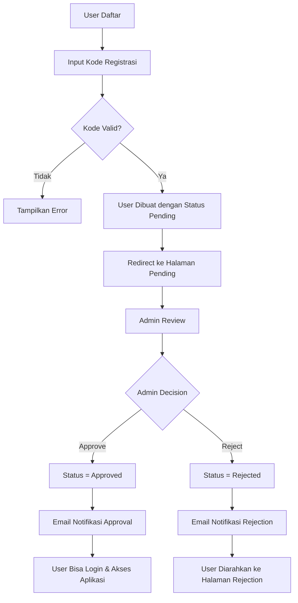

# 🚀 Sistem Registrasi Baru - Implementasi Lengkap

## 📋 **Overview**

Sistem registrasi telah diperbarui sesuai dengan requirements yang diberikan. User sekarang dibagi menjadi 3 tipe dengan sistem approval yang ketat.

## 🎯 **Fitur Utama yang Diimplementasikan**

### 1. **Tipe User Baru**
- **Partisipan**: Akses penuh ke ekosistem dan aksi kolektif
- **Tamu**: Hanya dapat terhubung dengan pengguna lain
- **Komunitas**: Hanya dapat terhubung dengan pengguna lain

### 2. **Sistem Kode Registrasi**
- Admin dapat membuat kode registrasi untuk setiap tipe user
- Kode menentukan tipe user secara otomatis
- Dapat dibatasi jumlah penggunaan dan tanggal kadaluarsa
- Tracking penggunaan kode

### 3. **Sistem Approval**
- User tidak langsung bisa masuk setelah registrasi
- Status pending sampai admin menyetujui
- Admin dapat memilih peran yang akan diberikan
- Email notifikasi otomatis untuk approval/rejection

### 4. **Kontrol Akses**
- Middleware memeriksa status approval
- User pending diarahkan ke halaman pending
- User rejected diarahkan ke halaman rejection
- Hanya user approved yang bisa akses aplikasi

## 🗄️ **Database Schema**

### **Tabel `users` (Updated)**
```sql
- user_type (enum: partisipan, tamu, komunitas)
- registration_key (string, nullable)
- approval_status (enum: pending, approved, rejected)
- assigned_role (string, nullable)
- approved_at (timestamp, nullable)
- approved_by (foreign key to users)
- approval_reason (text, nullable)
```

### **Tabel `registration_keys` (New)**
```sql
- id (primary key)
- key (string, unique)
- user_type (enum: partisipan, tamu, komunitas)
- description (text, nullable)
- is_active (boolean)
- usage_count (integer)
- max_usage (integer, nullable)
- expires_at (timestamp, nullable)
- created_by (foreign key to users)
- timestamps
```

## 🔧 **Komponen yang Dibuat/Dimodifikasi**

### **Models**
- `User.php` - Updated dengan field dan method baru
- `RegistrationKey.php` - Model baru untuk kode registrasi

### **Livewire Components**
- `Register.php` - Updated untuk sistem kode registrasi
- `PendingApproval.php` - Halaman untuk user pending
- `Rejected.php` - Halaman untuk user ditolak
- `ManageRegistrationKeys.php` - Admin interface untuk kelola kode
- `UserApprovalManagement.php` - Admin interface untuk approval user

### **Middleware**
- `CheckUserApproval.php` - Memeriksa status approval user

### **Notifications**
- `UserApprovalNotification.php` - Email notifikasi approval
- `UserRejectionNotification.php` - Email notifikasi rejection

### **Email Templates**
- `emails/user/approval.blade.php` - Template email approval
- `emails/user/rejection.blade.php` - Template email rejection

## 🛠️ **Cara Penggunaan**

### **Untuk Admin:**

1. **Membuat Kode Registrasi:**
   - Login sebagai super admin
   - Akses `/admin/registration-keys`
   - Klik "Buat Kode Baru"
   - Pilih tipe user, isi deskripsi, set batas penggunaan
   - Kode akan dibuat otomatis

2. **Mengelola User:**
   - Akses `/admin/user-approvals`
   - Lihat daftar user yang pending
   - Klik "Kelola" untuk approve/reject
   - Pilih peran yang akan diberikan
   - User akan menerima email notifikasi

### **Untuk User:**

1. **Registrasi:**
   - Dapatkan kode registrasi dari admin
   - Akses halaman register
   - Isi data dan masukkan kode registrasi
   - Submit form (tidak langsung login)

2. **Menunggu Approval:**
   - User akan diarahkan ke halaman pending
   - Tunggu email notifikasi dari admin
   - Jika approved, bisa login dan akses aplikasi
   - Jika rejected, bisa daftar ulang

## 🔑 **Kode Registrasi yang Tersedia**

Setelah menjalankan seeder, tersedia kode berikut:

- `PARTISIPAN2024` - Partisipan (100 uses)
- `TAMU2024` - Tamu (50 uses)  
- `KOMUNITAS2024` - Komunitas (30 uses)
- `PARTISIPAN_UNLIMITED` - Partisipan (unlimited)
- `TEST_EXPIRED` - Tamu (expired untuk testing)

## 🚦 **Flow Registrasi Baru**



## 🔐 **Kontrol Akses Berdasarkan Tipe User**

### **Partisipan:**
- ✅ Akses penuh ke ekosistem
- ✅ Akses penuh ke aksi kolektif
- ✅ Bisa terhubung dengan user lain
- ✅ Bisa menjadi ecosystem builder (jika disetujui admin)

### **Tamu & Komunitas:**
- ❌ Tidak bisa akses ekosistem
- ❌ Tidak bisa akses aksi kolektif
- ✅ Bisa terhubung dengan user lain
- ❌ Tidak bisa menjadi ecosystem builder

## 📧 **Email Notifications**

### **Approval Email:**
- Konfirmasi user telah disetujui
- Informasi tipe user dan peran yang diberikan
- Link untuk login ke aplikasi
- Panduan langkah selanjutnya

### **Rejection Email:**
- Informasi penolakan
- Alasan penolakan (jika ada)
- Saran untuk daftar ulang
- Kontak support

## 🧪 **Testing**

### **Test Registration Flow:**
1. Gunakan kode `PARTISIPAN2024` untuk daftar sebagai partisipan
2. Gunakan kode `TAMU2024` untuk daftar sebagai tamu
3. Coba kode `TEST_EXPIRED` untuk test kode yang expired
4. Test approval/rejection melalui admin interface

### **Test Access Control:**
1. Login sebagai partisipan - harus bisa akses semua fitur
2. Login sebagai tamu - hanya bisa akses connections
3. Test middleware dengan user pending/rejected

## 🔄 **Migration & Seeding**

```bash
# Run migrations
php artisan migrate

# Seed registration keys
php artisan db:seed --class=RegistrationKeySeeder
```

## 📝 **Notes**

- Sistem ini backward compatible dengan user lama
- User lama tanpa `user_type` tetap bisa akses normal
- Middleware hanya berlaku untuk user dengan `user_type`
- Email templates menggunakan layout yang konsisten
- Admin interface fully responsive dan user-friendly

## 🎉 **Status Implementasi**

✅ **SELESAI** - Semua requirements telah diimplementasikan dan siap untuk testing!

---

**Dibuat oleh:** AI Assistant  
**Tanggal:** 18 September 2025  
**Versi:** 1.0.0
